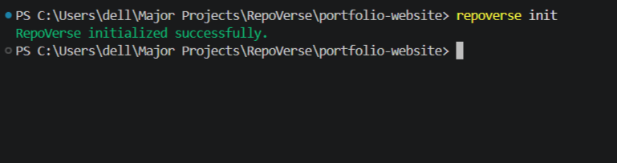
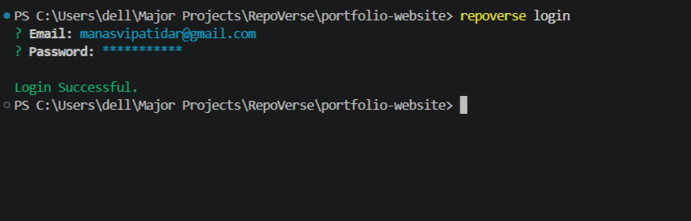
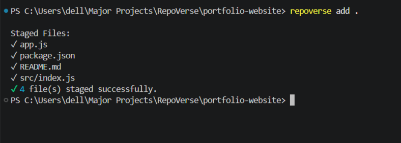
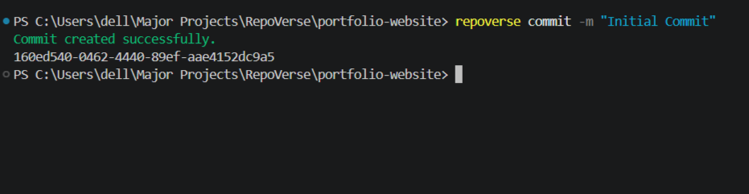
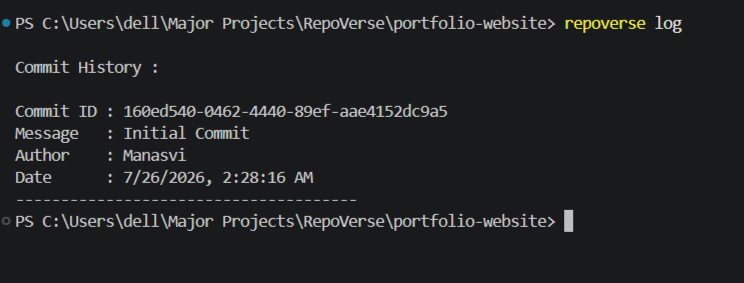
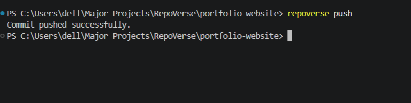
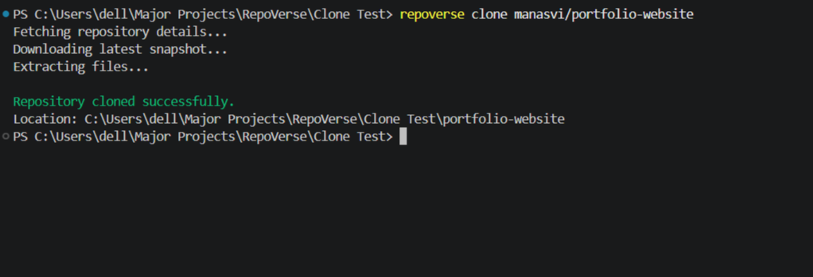
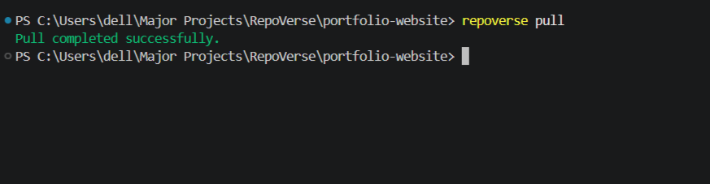
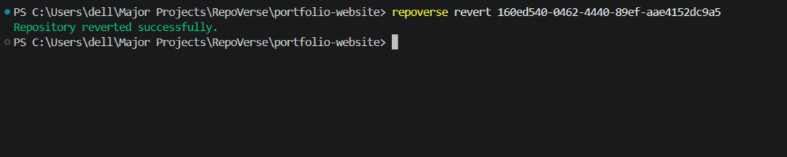

# RepoVerse CLI

> Official Command Line Interface for **RepoVerse** — a Full Stack Version Control System.

The RepoVerse CLI enables developers to initialize repositories, authenticate with the RepoVerse backend, stage files, create commits, view commit history, push snapshots, pull the latest changes, clone public repositories, and revert to previous commits directly from the terminal.

---

## ✨ Features

- Initialize a local RepoVerse repository
- User authentication from the terminal
- Stage files before committing
- Create local commits
- View complete commit history
- Push repository snapshots to the backend
- Pull the latest repository snapshot
- Clone public repositories
- Revert to previous commits
- Automatic repository metadata management
- Colored terminal output using Chalk
- Cross-platform support (Windows, Linux, macOS)

---

## 🛠️ Tech Stack

- Node.js
- Commander.js
- Axios
- Inquirer.js
- Chalk
- Archiver
- Extract-Zip
- FormData
- UUID

---

# 📸 CLI Screenshots

### 🚀 Initialize Repository



---

### 🔐 Login



---

### 📦 Stage Files



---

### 💾 Create Commit



---

### 📜 View Commit History



---

### ☁️ Push Commit



---

### 📂 Clone Repository



---

### 📥 Pull Latest Changes



---

### ⏪ Revert to Previous Commit



---

## 🚀 Installation

From the root of the **RepoVerse** project:

```bash
cd cli

npm install

npm link
```

Verify the installation:

```bash
repoverse --help
```

---

## 📚 Available Commands

### 🚀 Initialize Repository

```bash
repoverse init
```

Creates a new `.repoverse` directory inside the current project.

---

### 🔐 Login

```bash
repoverse login
```

Authenticates the user with the RepoVerse backend and stores the authentication token locally.

---

### 📦 Stage Files

```bash
repoverse add
```

Stages all modified files for the next commit.

---

### 💾 Create Commit

```bash
repoverse commit "Your commit message"
```

Creates a local commit from the staged files.

---

### 📜 View Commit History

```bash
repoverse log
```

Displays the complete commit history of the current repository including commit ID, author, commit message, and timestamp.

---

### ☁️ Push Commit

```bash
repoverse push
```

Uploads the latest commit snapshot to the RepoVerse backend.

---

### 📥 Pull Repository

```bash
repoverse pull
```

Downloads the latest repository snapshot from the backend.

---

### 📂 Clone Repository

```bash
repoverse clone username/repository-name
```

Downloads a public repository and recreates the complete project locally.

Example:

```bash
repoverse clone manasvi/demo-project
```

---

### ⏪ Revert Commit

```bash
repoverse revert <commit-id>
```

Restores the repository to the specified commit snapshot.

Example:

```bash
repoverse revert e9d3f82b
```

---

## 📂 CLI Structure

```text
cli/
│
├── commands/
├── utils/
├── config.js
├── index.js
└── README.md
```

---

## 📁 Generated Repository Structure

After running:

```bash
repoverse init
```

the following structure is created inside your project:

```
project/
│
├── .repoverse/
│   ├── commits/
│   ├── config.json
│   ├── index.json
│   └── HEAD
│
└── project files...
```

---

## 🔄 Typical Workflow

```text
repoverse init
        │
        ▼
repoverse login
        │
        ▼
repoverse add
        │
        ▼
repoverse commit "Initial Commit"
        │
        ▼
repoverse log
        │
        ▼
repoverse push
```

Retrieve the latest changes:

```text
repoverse pull
```

Clone a public repository:

```text
repoverse clone username/repository-name
```

Restore a previous snapshot:

```text
repoverse revert <commit-id>
```

---

## 🔗 Backend Requirement

The CLI communicates with the **RepoVerse Backend API**.

Before using the CLI, ensure the backend server is running or deployed and that the backend URL inside `config.js` points to the correct server.

---

## 👨‍💻 Author

**Manasvi Patidar**

Developed as the command-line interface for **RepoVerse**, a Full Stack Version Control System built to demonstrate custom version control concepts, repository management, commit tracking, snapshot synchronization, and terminal-based developer workflows.
